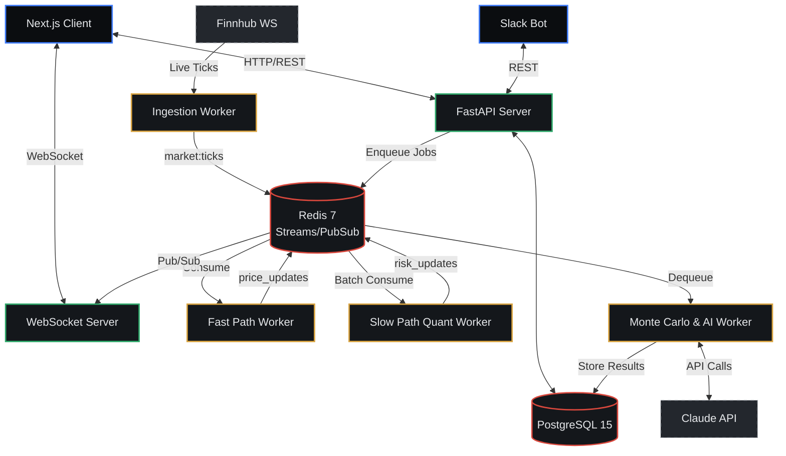

<div align="center">
  <h1>🎯 RiskLens</h1>
  <p><b>Continuous, Event-Driven Quantitative Risk Monitoring</b></p>
  
  [](https://python.org)
  [](https://fastapi.tiangolo.com)
  [](https://nextjs.org)
  [](https://postgresql.org)
  [](https://redis.io)
  [](https://docker.com)
</div>

<br>

**RiskLens** is a full-stack, event-driven quantitative risk platform. Unlike traditional dashboards where you pull data, RiskLens *pushes* insights to you. It continuously watches an investment portfolio, quantifies risk in real time, detects when risk crosses a configurable budget threshold, and pushes alerts with ranked action recommendations. 

A tool-calling AI layer narrates results and answers what-if questions, ensuring all numeric computations are performed by the deterministic quant engine, never hallucinated by the LLM.

> ⚠️ <span style="color:#D9483D">**Advisory only:**</span> RiskLens never executes trades. All recommendations require explicit user action outside the system.

---

## 🌟 Key Features

- ⚡ **Real-Time Event-Driven Updates:** Ticks ingested via WebSockets (Finnhub) and streamed to the UI instantly using Redis Pub/Sub.
- 📊 **Advanced Quant Engine:**
  - **VaR & CVaR** (Value at Risk & Conditional Value at Risk)
  - **GARCH(1,1)** Volatility Modeling
  - **Monte Carlo Simulations** using Geometric Brownian Motion (GBM)
  - **EVT (Extreme Value Theory)** for accurate tail-risk estimation
  - **Ledoit-Wolf** Covariance Shrinkage
- 🚨 **Proactive Risk Alerts:** Configure a risk budget and receive real-time alerts if portfolio risk crosses from <span style="color:#2FA96B">SAFE</span> to <span style="color:#D9A441">WATCH</span> or <span style="color:#D9483D">BREACH</span>.
- 🤖 **AI Risk Analyst:** Ask "What if NVDA drops 20%?" and get deterministic results simulated by the quant engine, narrated by an AI agent (LangGraph + Anthropic Claude).
- 🧩 **Correlation & Concentration Detection:** Uncover hidden risks where seemingly diversified assets move together.
- 📉 **Historical Replay:** Rewind time and backtest your portfolio against real market stress periods with Kupiec proportion-of-failures validation.

---

## 🏛️ Architecture & Design

RiskLens is designed for scalability and asynchronous event-driven processing. It separates the "fast path" (price ticks) from the "slow path" (heavy covariance matrix and Monte Carlo calculations).

### System Diagram



### The Design Philosophy
1. **Numbers are Computed, Never Guessed:** The AI layer is strictly sandboxed. It can only call tools to run deterministic math; it cannot invent numbers.
2. **Push, Not Pull:** Users shouldn't have to hit "refresh" to know if they are over budget.
3. **Restrained, Data-Dense UI:** Built with a premium dark mode, utilizing Semantic colors (`#2FA96B` for Safe, `#D9483D` for Breach) and avoiding unnecessary decorative elements. Typography focuses on making numbers easily readable.

---

## 🛠️ Technology Stack

| Component | Technology | Purpose |
|---|---|---|
| **Frontend** | Next.js 14, React, Tailwind CSS | High-performance React app with SSR & App Router. Zustand for state. |
| **Backend** | Python 3.12, FastAPI | Asynchronous REST and WebSocket API. |
| **Quant Engine** | NumPy, SciPy, pandas, ARCH | Matrix operations, stat models, EVT, GARCH, and data manipulation. |
| **Database** | PostgreSQL 15, asyncpg, Alembic | Relational data persistence (Users, Portfolios, Snapshots). |
| **Events/Queue** | Redis 7, `arq` | Pub/Sub for WebSockets, Streams for tick ingestion, Queue for async jobs. |
| **AI Layer** | LangGraph, Claude API | ReAct agent orchestration and tool execution. |

---

## 📂 Project Structure

```text
RiskLens/
├── backend/                  # Python/FastAPI Backend
│   ├── app/                  # Core API logic
│   │   ├── api/              # REST Routers
│   │   ├── auth/             # JWT & Password Auth
│   │   ├── portfolios/       # CSV Ingest, Holdings Management
│   │   ├── risk/             # Core Quant Math & Risk logic
│   │   └── ...
│   ├── workers/              # Standalone ARQ/Redis consumers
│   ├── quant/                # Pure deterministic math functions
│   ├── alembic/              # Database migrations
│   └── tests/                # Pytest unit & integration tests
├── frontend/                 # Next.js 14 Frontend
│   ├── app/                  # App Router Pages
│   ├── components/           # Reusable UI & Charts
│   ├── store/                # Zustand State
│   └── lib/                  # API clients, utilities
└── docker-compose.yml        # Local orchestrated environment
```

---

## 🚀 Quick Start (Docker)

The fastest way to get RiskLens running locally is using Docker Compose. This will spin up the database, cache, backend, and frontend containers automatically.

### Prerequisites
- [Docker & Docker Compose](https://www.docker.com/products/docker-desktop/)

### 1. Clone & Configure
```bash
git clone https://github.com/krishna01235/RiskLens.git
cd RiskLens

# Backend env setup
cp backend/.env.example backend/.env
# (Optional) Edit backend/.env to add FINNHUB_API_KEY and ANTHROPIC_API_KEY

# Frontend env setup
cp frontend/.env.example frontend/.env
```

### 2. Launch the Stack
```bash
docker compose up --build
```

### 3. Verify
- **Frontend Dashboard:** [http://localhost:3000](http://localhost:3000)
- **Backend API Docs:** [http://localhost:8000/docs](http://localhost:8000/docs)
- **Database:** PostgreSQL running on `localhost:5432`
- **Cache:** Redis running on `localhost:6379`

### 4. Create a Demo Portfolio
Open the frontend dashboard, register a new account, and click **"Demo Portfolio"** to seed your account with a mix of US Tech stocks and view the live risk calculations.

---

## 🔒 Security

- **Authentication:** Custom JWT implementation (Access + HttpOnly Refresh Cookies).
- **Password Hashing:** `bcrypt` configured with secure work factors.
- **Data Isolation:** All portfolio, alert, and holding queries are strictly scoped to the authenticated `user_id` at the database level.
- **AI Sandboxing:** User prompts are parameterized; AI cannot access raw database tables, only specific quantified summary endpoints.

---

<div align="center">
  <p><i>Built with precision.</i></p>
</div>
